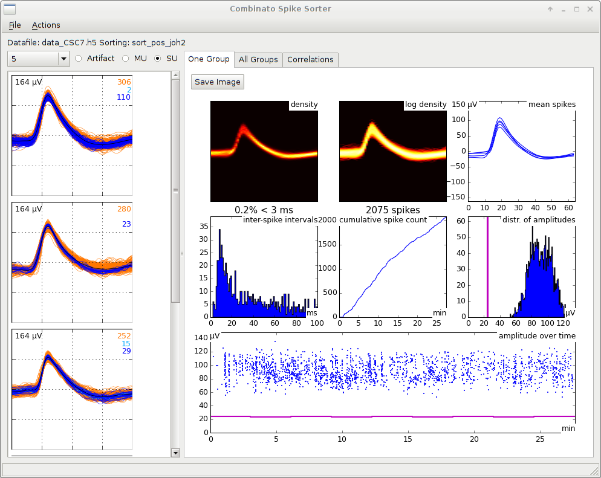
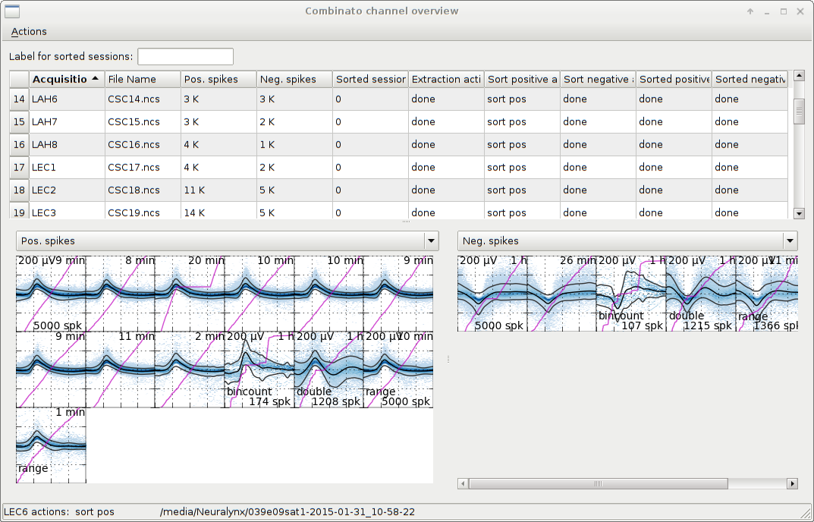

# Combinato Spike Sorting

## Introduction
_Combinato Spike Sorting_ is a collection of tools for spike extraction, automatic spike sorting, manual improvement of sorting, artifact rejection, and visualization of continuous recordings and spikes. It offers a toolchain that transforms raw data into clean single/multi-unit spike trains. The software is largely modular, thus useful also if you are interested in just extraction or just sorting of spikes.

Combinato Spike Sorting works very well with large raw data files (tested with 100-channel, 15-hour recordings, i.e. > 300 GB of raw data). Most parts make use of multiprocessing and scale well with tens of CPUs.

The spike sorting part of this repository borrows many ideas from WaveClus ([Journal Article][0], [Website][2]) by Rodrigo Quian Quiroga.

Combinato is a collection of a few command-line tools and two GUIs, written in Python and depending on a few standard modules. It is being developed mostly for Linux, but on Windows, most parts should work equally well.

## Installation

Spike sorting depends on the binary `cluster_linux.exe` (on Windows: `Cluster.exe`, on OS X: `cluster_maci.exe`) described [in this article][1] and [available online][2] (click on _Codes_).

### On Linux 

If you do not have `git` installed, use your distribution's package manager to install it.

Then clone combinato's repository:

`git clone https://github.com/wasserverein/combinato.git`,

or, if you have uploaded your public key,

`git clone git@github.com:wasserverein/combinato.git`.

#### Setting paths on Linux (this also applies to OS X)
The relevant executables all reside in the root folder of the repository. You probably want to call them from the command line, so add the folder `combinato` to your `$PATH`.

I also recommend making the `combinato` module (this is a folder _inside_ the repository) visible to Python. You can either create a symbolic link in `/usr/local/lib/python2.7/dist-packages` pointing to the `combinato` folder, or you can add the `combinato` folder to your `$PYTHONPATH`.

##### Example
I use the following setup:

The repository is
`/home/johannes/combinato`.

My shell's configuration contains

`PATH=$PATH:/home/johannes/combinato`

`PYTHONPATH=$PYTHONPATH:/home/johannes/combinato`

`export PATH PYTHONPATH`

#### Dependencies
Combinato Spike Sorting tools depend on
`numpy`, `scipy`, `pywt`, `matplotlib`, `pytables`, and `pyqt`.

However, not all parts depend on all of these packages, so it is perfectly reasonable to clone the repository, start working and then install dependencies on the fly as needed.

Before running any Combinato commands, copy the file `default_options.py` to `options.py`. This ensures that your locally set options are not tracked by git.

Set the local path to the `cluster_linux.exe` binary in `options.py`. Also check that `cluster_linux.exe` runs (`chmod +x cluster_linux.exe; ./cluster_linux.exe`). If that does not work, you probably have to activate [multi-architecture support][9].

### On Windows
Install a Python Distribution (e.g. [Anaconda][5] by [Continuum][6]) and place the Combinato repository in an appropriate folder (e.g. `C:\Users\YourUsername\Anaconda\Lib\site-packages` if using Anaconda). Then copy `default_options.py` to `options.py`. Change the path to the cluster binary (`Cluster.exe`) in `options.py`.

### On OS X
Install a Python Distribution (e.g. [Anaconda][5] by [Continuum][6]) and place the Combinato repository somewhere, (e.g. `/Applications/anaconda/lib/python2.7/site-packages`, but any other location is fine). To use the programs that are part of Combinato from a Terminal, add the path to the repository to your `PATH`, e.g. by inserting

`export PATH=$PATH:/Applications/anaconda/lib/python2.7/site-packages/combinato`

in your `.bash_profile`.

Also copy `default_options.py` to `combinato/options.py` and modify the path to the cluster binary (`cluster_maci.exe`).

Then you should be ready to use `css-extract`, `css-cluster`, `css-gui` etc.

## Caveat
I am not a trained software engineer, and when I started this project, I had little experience with Python and Qt. This means that the code is redundant at some points and that the style of the code could be improved. I am aware of several issues and I am constantly reducing redundancies.

Most commands have command line options. I'm working on a more unified syntax for these.

## Testing
After the installation, you can run the small script `test_installation.py` in the `tools` directory of this respository. It checks whether your paths are set correctly.

## Main executables 
Combinato Spike Sorting consists of the following main executables

| Executable                                         | Used for                      |
|----------------------------------------------------|-------------------------------|
|`css-extract`                                       | automatic spike extraction    |
|`css-prepare-sorting`, `css-cluster`, `css-combine` | automatic spike sorting (suited for very long recordings) |
|`css-gui`                                           | visualization and manual improvement of sorting |

They come along with a few other convenient tools

| Executable                                  | Used for 		       |
|---------------------------------------------|--------------------------------|
| `css-find-concurrent`, `css-mask-artifacts` | pre-sorting artifact detection |
| `css-plot-rawsignal` | generating raw data quality plots |
| `css-plot-extracted` | plotting overview figures of extracted spikes and artifacts |
| `css-plot-sorted`	| plotting overview figures of sorted spikes and artifacts |
| `css-overview-gui` | displaying various overview plots |

## Workflow

### Choosing channels for spike extraction
If you expect all channels to be usable, simply extract spikes from all channels (see below). 

If instead you think a number of channels should be excluded from spike extraction, do a raw data overview plot first by calling

`css-plot-rawsignal`

When the plots are ready, use

`css-overview-gui` 

to view them and to deselect broken/noisy channels from spike extraction.

### Extracting spikes
*Important to know:* Spike extraction in Combinato is currently implemented for [Neuralynx][7] .ncs and Matlab .mat files only. In the following, the workflow for .ncs files is described.

Use

`css-extract`

to extract spikes from channels, either from all channels (`css-extract --files *.ncs`) or from the ones selected in `css-overview-gui` before (`css-extract --jobs do_extract.txt`). 

`css-extract --help` displays more information.

`css-extract` creates a folder for each file from which it extracts spikes. Inside each folder, a file `data_xyz.h5` is created, where `xyz` is the channel name. These files contain the extracted, re-aligned, spikes. Of course, you can also create these files by yourself and then continue with spike sorting.

#### Remark on file formats
The file format of the `data_xyz.h5` files is the versatile [HDF5][3] format. Combinato accesses these files through the [PyTables][4] library. The main advantages of the [HDF5][3] format are that it allows access to parts of arrays (closed source technologies such as Matlab only have rudimentary support for partial array manipulation). Furthermore, the [HDF5][3] format is open source, cross-platform and optimized for large datafiles.

The data is stored in the `data_xyz.h5` files in the following way

|Node | Type |  Meaning|
|-----|------|---------|
|pos  | Group| For spikes, times with “positive” amplitude    |
|neg  | Group| For spikes, times with “negative” amplitude |
| pos.spikes | (n_spikes, n_samples) array |  Spikes with positive amplitude | 
| pos.times  | (n_spikes) array | Times of spikes with positive amplitude |
| pos.artifacts | (n_spikes, 2) array | Artifact types per spike |
| neg.spikes | same for negative | ...|
| neg.times | ... | ... |
| neg.artifacts | ... | ... |
| thr| (n_windows, 3) array | extraction thresholds with their start and end times |
The following rules apply

- Spikes are in microvolts, one row per spike, one column per sample
- Times are in milliseconds

##### Meaning of the node “artifacts”

|Value| Artifact type        | Default criterion |
|-----|----------------------|-------------------|
|0    | No artifact	     |  |
|1    |Firing rate too high  | > 200 Hz            |
|2    |Amplitude too high    | > 1 millivolt       |
| 4   |Too many active channels |> 50 % of all channels |

It is debatable whether it is a good idea to store positive and negative spikes in one file. Of course, for spike sorting and other analyses it suffices to have only one of them. The main advantage of this structure is that for bipoloar recordings, a spike extraction procedure should filter the data only once and then extract both positive and negative spikes at the same time.

#### Remark on multiprocessing
`css-extract` uses 8 cores by default. Change the variable `nWorkers` if you run into memory issues. If the extraction takes a long time, check the data transfer rate of your network, which is the most likely bottleneck especially on 100 Mbit/s networks.

### Pre-sorting artifact removal
For long-term recordings, it's often important to remove extracted events that are not neural in origin, such as movement artifacts or periods of excessive 50/60 Hz noise. To identify these artifacts, run

`css-find-concurrent`

which creates a file *concurrent_times.h5* containing information on events that occur on several channels concurrently,
and then

`css-mask-artifacts`

and use `css-mask-artifacts --help` to read more about command line options. 

Use `css-plot-extracted` to create plots of the spikes after artifact removal. These plots display the different artifact types, and also visualize cumulative spike counts over time. `css-overview-gui` displays these plots in a convenient way.

### Sorting spikes
Combinato Spike Sorting works with *job files*, but using them is not mandatory.
If you simply want to sort all extracted spikes, go to a folder containing a `data_xyz.h5` file and create a job file by calling

`css-prepare-sorting [--neg] --datafile data_xyz.h5`

and then

`css-cluster --jobs sort_pos_abc.txt`

or

`css-cluster --jobs sort_neg_abc.txt`

where `pos` or `neg` is the amplitude polarity of the spikes, and `abc` are the first three letters of your username (introduced automatically so that several users can smoothly analyze the same datasets at the same time without interference).

Note that `sort_pos_abc.txt` is just a text file in the current folder, created by `css-prepare-sorting`. You can read, edit, and rename it as you prefer.

If you want to exclude channels from sorting (e.g. because they contain only artifacts), call `css-plot-extracted` and then `css-overview-gui` to exclude those channels that you do not want to sort.

Some paramters in `options.py` control details of the sorting process. The most relevant ones are listed here.

##### Important sorting parameters

|Name in `options.py`          | Meaning | Default| When to change|
|------------------------------|---------|---------|---------------|
|`MinSpikesPerClusterMultiSelect`|Minimal size of a cluster| 15| Raise when you see too many small clusters|
|`MaxClustersPerTemp`           |Maximal number of clusters at one temperature| 5 | Raise (up to about 7-10) when you see under-clustering | 
|`RecursiveDepth`              | Clustering iterations | 1 | Set to 2 or 3 when you see under-clustering, especially under-clustered large clusters |
|`ReclusterClusters`	      | Should large clusters be re-clustered? | True | Only set to False when you see *substantial* over-clustering|
|`MinInputSizeRecluster`	      | Minimal size of a cluster to be re-clustered| 2000 | Lower when you see under-clustering of medium size clusters | 
|`FirstMatchFactor` | Acceptance radius for first template matching step | .75 |Set to higher values when you need more template-matching |
|`SecondMatchFactor`| Acceptance radius for second template matching step| 3| Set to lower values when see too liberal template matching |
|`MaxDistGrouping` | Stop threshold for automatic cluster grouping | 2.2 | Most important parameter. Set to lower values (down to about 1.5) when you see too much grouping | 

*negative spikes*

use
`css-overview-gui` also to mark channels where you would like to sort "negative" spikes.

You will see that `css-prepare-sorting` creates a folder for each block of spikes that you want to sort. By default, each folder contains the sorting result for 20000 (non-artifact) spikes. The number 20000 seems to be a good trade-off between speed (sorting scales super-linearly with the number of spikes) and the ability to detect small clusters (typically, you need at least 15-25 spikes for a cluster to be found). `css-cluster` runs separate processes in parallel for each of these folders, which in turn enables efficient use of multi-core machines.

Of course, `css-overview-gui` creates only one folder if the total number of spikes is smaller than the block size.

### Concatenation of multiple sessions
After sorting, use `css-combine` to concatenate the data contained in the various folders. If you have a *job file* already, simply call

`css-combine --jobs sort_pos_abc.txt`

where `sort_pos_abc.txt` is the job file you used for clustering already.

If you do not use *job files*, you have to specify the options `--datafile`, `--sessions`, and `--label`.

Even if all sorted spikes are contained in one folder, you have to call `css-combine` to identify artifact clusters and to produce plots of the individual clusters.

#### Format of the sorting data
Each concatenated session consists of one folder `sort_SIGN_USER`, where `SIGN` indicates the spike polarity, and `USER` is a shorthand for the user name. Combinato stores plots of individual clusters and general sorting information in this folder. The structure of the file `sort_cat.h5` is as follows:

|Node     | Array size     |Meaning                          |
|---------|----------------|---------------------------------|
|index    | (n_spikes)     | Index to the `data_xyz.h5` file |
|classes  | (n_spikes)     | Cluster number for each spike | 
|matches  | (n_spikes)     | Template matching status for each spike |
|distance | (n_spikes)     | Distance at which template matching occured |
|artifacts| (n_clusters, 2)| Artifact status for each cluster |
|groups   | (n_clusters, 2)|  Group membership for each cluster |
|types    | (n_groups, 2)   | Group type for each group |

##### Remarks
- the classes, matches, and distance nodes contain information about spikes indexed by the index node. The reason for this additional indexing layer is that in this way, spikes from the `data_xyz.h5` file can be ignored without the need to delete them, by simply skipping them in the index node.
- distance contains the distance at which the second template matching step was performed for each spike.
- artifacts contains, for each cluster, whether it is an artifact cluster (1) or not (0).
- groups contains the group to which a cluster belongs.

##### Meaning of the node “matches” (per spike)

|Value| Spike assigned to cluster during|
|-----|---------------------------------|
|0    | SPC clustering  |
|1    | First template matching step |
|2    | Second template matching step |

##### Meaning of the node “types” (per group)
| Value | Group contains    |
|-------|------------|
|-1     | Artifacts |
| 0     | Unassigned spikes|
| 1     | A multi-unit | 
| 2     | A single-unit| 

### Checking and changing sorting results: The GUI
One of the main advantages of Combinato is that it has a relatively efficient GUI that enables you to modify sorting results, and displays a variety of visual cluster quality checks. These plots are updated on the fly, so that you can instantly see how a change in clustering influences various properties of the clustering.

Start the GUI by calling `css-gui`. Make sure to start the GUI in a folder containing the folders that contain the `data_xyz.h5` files. For example, if you have a file `/home/myname/experiment1/channel5/data_channel5.h5`, first move to `experiment1`, then start `css-gui`.

Use one of the following commands to load a sorting session. You can either open a sorting session with File-Open or you can use job files.

Here, a job file is simply a list of paths to `data_xyz.h5` files, saved as `do_manual_pos.txt` or `do_manual_neg.txt`, depending on the polarity of spikes. If you use job files, you can move from one sorting session to the next by key press, which can speed up the sorting review process considerably if you have many recording channels.

##### Basic GUI commands 1
| Menu | Command | Shortcut| Description |
|------|---------|---------|-------------| 
| File | Open    | Ctrl+O  | Load a sorted session for optimization|
| File | Open Jobs |       | Load a list of sorting jobs |
| Actions | Next Job | Ctrl+J | Load next job from joblist |
| Actions | Goto Job |    | Load a specific job from joblist |
| File | Save    | Ctrl+S  | Save changes to file |

Once a sorting session is loaded, the various groups of clusters appear as a pull-down menu. If you select a group in the pull-down menu, information about it is displayed in the different tabs.

#### The “One Group” tab
This tab collects informative plots about one group of clusters. Some of these are inspired by [this article][8] by D. Hill, S. Mehta, and D. Kleinfeld. 

Press Enter to additionally highlight information about a single cluster within a group. The information in this tab helps decide if a group (or a cluster in a group) is an artifact, or a multi or single-unit. Use the information in the following way.

| Subplot | How to use |
|---------|------------|
| (log) Density| If the density is inhomogeneous across sampling points, it is more likely that the group is a multi-unit. |
| Mean spikes | If some of the mean spikes differ a lot in shape, consider splitting the group into two or more groups. |
| Inter-spike intervals | If you see a clear comb-like pattern with peaks at 20, 40, 60 ms, the unit is an artifact or contains clusters that are artifacts. If the percentage of lags < 3 ms is high (> 5 %), it is unlikely that the group is a single-unit.|
| cumulative spike count | If the cumulative spike count contains clear 

#### The “All Groups” tab
This tab displays all groups, by plotting the mean spikes of all clusters in a group to represent that group. The main function of this tab

##### Basic GUI commands 2
| Menu    | Command   | Shortcut | Description |
|---------|-----------|----------|-------------|
| Actions | Merge all | Ctrl+M | Merge all clusters into group 1 |
| Actions | New Group | Ctrl+N | Create a new group, to which clusters can be added |
|         |           | Enter  | Highlight information about selected cluster |
|         |           | N      | Move to next group in group list |
|         |           | A      | Move selected cluster to artifacts group |
|         |           | G      | Move selected cluster to closest group |

# Sample workflow with new files after each step
Let's start with a file `CSC1.ncs`, placed in a folder `testdata`. Open a shell and go to the folder `testdata`. All following calls assume that `testdata` is your current working directory.

1. *optional* If you are using Linux, you can plot the continuous signal. Call

  `css-plot-rawsignal`.

  Look at the figure in `testdata/overview/`.

  On Windows, plotting the raw signal is currently not implemented.

2. Extract spikes by calling

  `css-extract --files CSC1.ncs`.

  The process takes some time.

  Check that there now is a folder `testdata/CSC1` containing the file `data_CSC1.h5`. 

3. *optional, but recommended* Mask artifact spikes by calling

  `css-mask-artifacts --no-concurrent`.

  The option `--no-concurrent` indicates that artifact masking should not try to use information from several channels, because you extracted spikes from one channel only. If you have multiple channels, you can call `css-concurrent` first, and then `css-mask-artifacts` with no option.

4. *optional* To plot the extracted spikes, call

  `css-plot-extracted`.

  The figure is placed in `testdata/overview`, its name begins with `spikes_`. The different artifact types are marked in the figure.

5. Now you have to tell Combinato which spikes to sort. Call

  `css-prepare-sorting --data CSC1/data_CSC1.h5`.

  This step might seem unnecessarily complicated, but it is extremely handy when you would like to sort only spikes from certain time periods, e.g. for sleep recordings or multi-part experiments. 

  There is now a file `sort_pos_abc.txt`, where `abc` is a shorthand for your username. In the following, use the real shorthand instead of the `abc` appearing in this manual. This file lists all sessions that you can now begin to sort.

  There also is a folder `CSC1/sort_pos_abc_000...`, where temporary files from the spike sorting process will reside.

6. Ready to sort the spikes. Call

  `css-cluster --jobs sort_pos_abc.txt`.

  This starts the clustering process.

7. Combine the many clusters into cluster groups by calling

  `css-combine --jobs sort_pos_abc.txt`.

  This step may seem overly complicated again, but it is useful to separate clustering and cluster combinining, especially when you would like to optimize the automatic combination process by parameter tuning, without repeating the whole clustering procedure all over.
  
  There is now a folder `testdata/CSC1/sort_pos_abc`, which contains plots of all clusters.

8. *optional* Plot the sorting result by calling
  `css-plot-sorted --label sort_pos_abc`

  The `label` parameter comes in because Combinato allows to store several alternative “sortings”, which can then be plotted independently.

  The resulting plot is stored in `testdata/overview` again.

9. *optional* Use the GUIs to optimize results
  
  Call
  
  `css-overview-gui`,

  enter the sorting label `sort_pos_abc` and initialize the folder (from the menu or by pressing `Ctrl+I`).

  You will see a representation of the sorting result. If you would like to change something, call

  `css-gui`,

  load the channel and change the clustering as you like.

# Contributing
I'm always happy to see pull requests, feature suggestions and bug reports. Please see the GitHub site for more information.

[0]: http://www.mitpressjournals.org/doi/abs/10.1162/089976604774201631 "R. Quian Quiroga, Z. Nadasdy, Y. Ben-Shaul: “Unsupervised Spike Detection and Sorting with Wavelets and Superparamagnetic Clustering”. Neural Computation 16, no. 8 (August 2004): 1661–87."
[1]: http://journals.aps.org/pre/abstract/10.1103/PhysRevE.57.3767 "M. Blatt, S. Wiseman, E. Domany: “Superparamagnetic Clustering of Data”. Physical Review E 57, no. 4 (April 1998): 3767–83"
[2]: http://www2.le.ac.uk/departments/engineering/research/bioengineering/neuroengineering-lab/spike-sorting "Spike Sorting with Wave_Clus"
[3]: http://www.hdfgroup.org/HDF5/whatishdf5.html 
[4]: http://www.pytables.org
[5]: http://continuum.io/downloads
[6]: http://www.continuum.io
[7]: http://neuralynx.com

[8]: http://www.jneurosci.org/content/31/24/8699 "D. Hill, S. Mehta, D. Kleinfeld: “Quality Metrics to Accompany Spike Sorting of Extracellular Signals”. The Journal of Neuroscience”. The Journal of Neuroscience 31 (24): 8699–8705" 
[9]: http://askubuntu.com/a/454254

