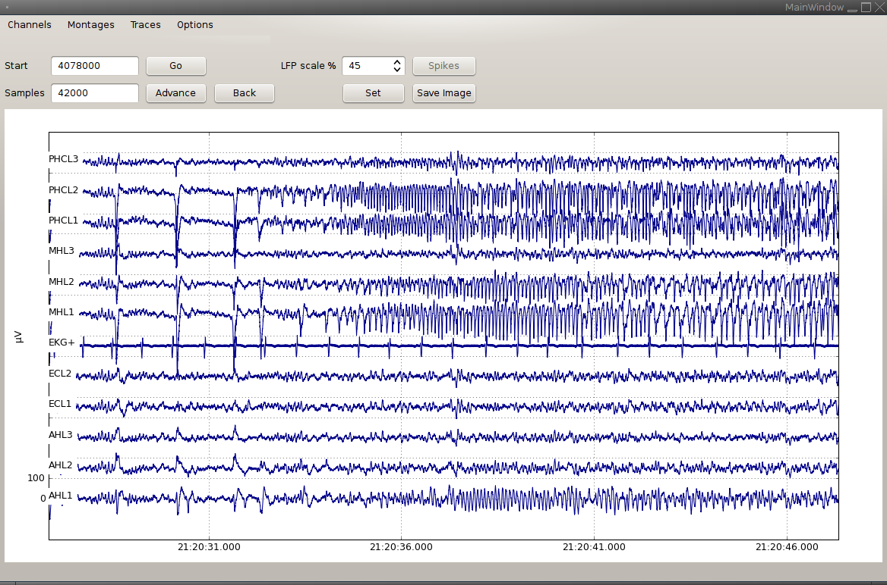

# The Signalviewer

## Converting files

Use `css-ncs-downsample` to convert files from the `ncs`-format to files that the viewer can read. Use the option `--q` to specify the downsampling factor. If you specify `--q 1`, the file is converted without downsampling.

## Viewing files

Start `css-signalviewer` in a directory containing converted files. The menu "Channels" lists all available channels. 

### Working with montages

To use a montage, create a file called `my_montage.txt` in the folder containing the converted files. Each line of the file contains either one channel name, such as `LA1`, or a difference of channel names, such as `AHL1-AHL2`.

### Working with wall clock times

To view the recording with times from the wall clock, call `parse_cheetah_logfile.py --write-datetime`. This creates a file with the necessary time conversion information. You can then use the "Options" menu to enable the wall clock time.
